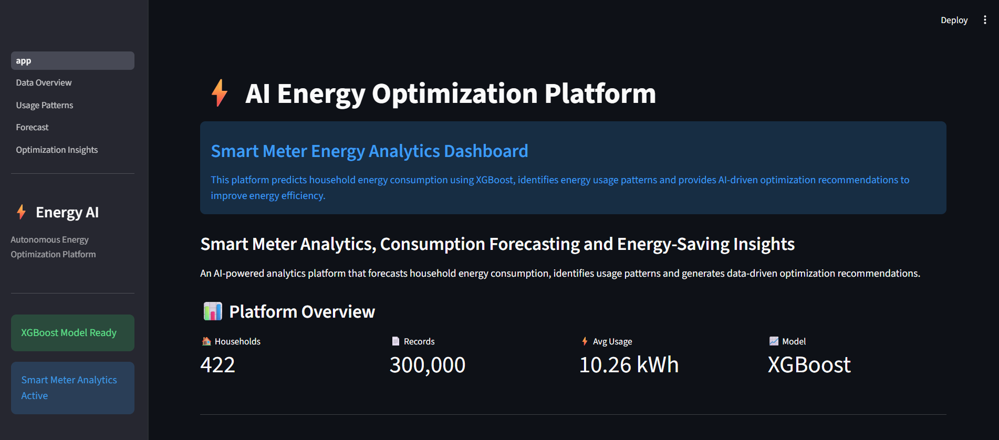
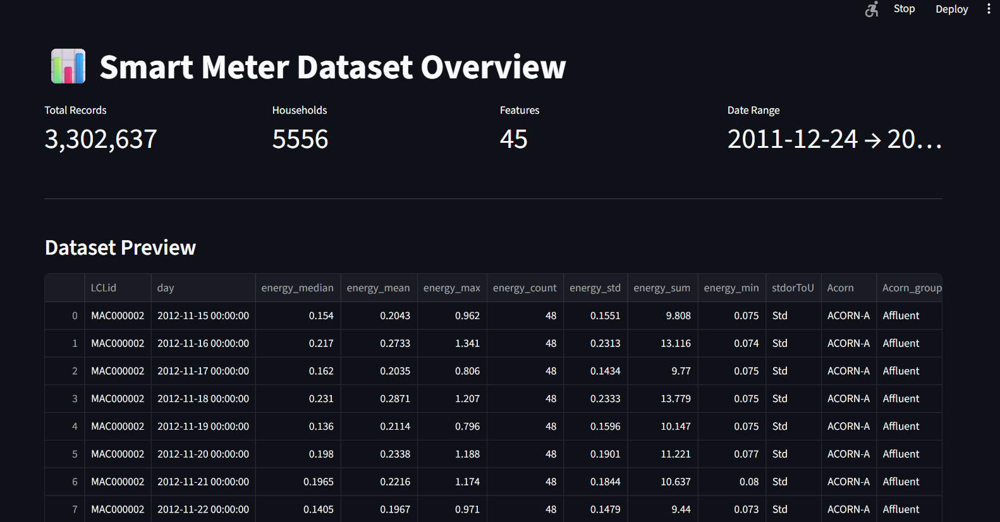
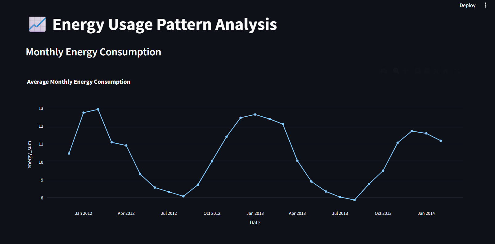
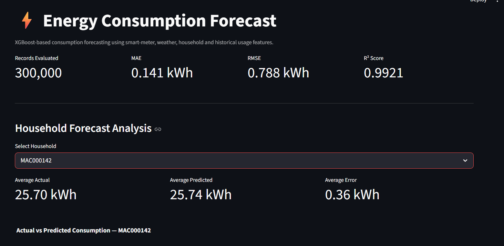
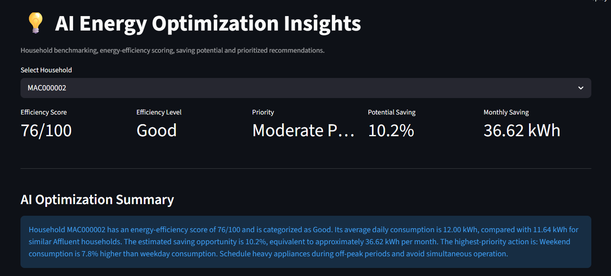
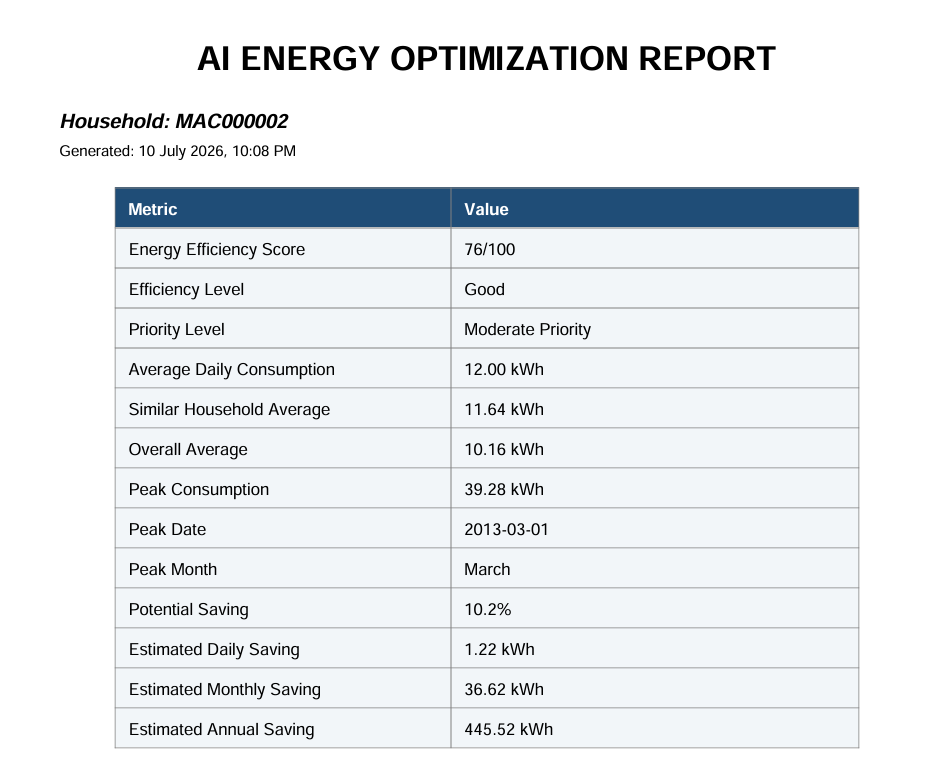

<div align="center">

# ⚡ AI Energy Optimization Platform

### Autonomous Smart Meter Analytics & Energy Forecasting System

An end-to-end AI-powered energy analytics platform that forecasts household electricity consumption, analyzes usage patterns, detects optimization opportunities, and generates actionable energy-saving recommendations using Smart Meter and Weather data.


</div>

---

# 📌 Project Overview

The **AI Energy Optimization Platform** is an end-to-end Machine Learning application designed to analyze household electricity consumption using London's Smart Meter dataset.

The platform combines:

- Smart Meter Data
- Household Demographic Information
- Weather Data

to build an intelligent energy analytics system capable of:

- Forecasting future energy consumption
- Understanding household usage behaviour
- Comparing households with similar profiles
- Estimating potential energy savings
- Generating optimization recommendations
- Producing professional downloadable reports

Unlike traditional forecasting systems that only predict electricity demand, this platform also provides analytical insights that help improve household energy efficiency.

---

# ❗ Problem Statement

Electricity providers collect millions of smart meter readings every day.

Although this data contains valuable information, it is difficult to answer questions such as:

- Which households consume excessive electricity?
- How does weather affect energy demand?
- Which season has the highest consumption?
- Are weekends consuming more energy?
- Which households have the highest optimization potential?
- How much energy can be saved?

Existing systems mostly visualize consumption without providing intelligent optimization insights.

The objective of this project is to build an AI-powered analytics platform capable of converting raw smart meter data into meaningful business insights.

---

# 🎯 Project Objectives

The primary objectives of this project are:

### 1. Forecast Energy Consumption

Predict future household electricity consumption using Machine Learning.

---

### 2. Analyze Consumption Behaviour

Understand:

- Monthly patterns
- Seasonal patterns
- Weekend vs Weekday usage
- Household categories
- Weather influence

---

### 3. Identify Optimization Opportunities

Detect inefficient consumption patterns and estimate possible energy savings.

---

### 4. Generate Actionable Recommendations

Provide household-specific optimization recommendations based on historical consumption behaviour.

---

### 5. Interactive Analytics Dashboard

Allow users to explore:

- Forecasts
- Usage trends
- KPIs
- Reports
- Optimization metrics

through an interactive Streamlit dashboard.

---

# 💼 Business Value

This project can assist:

- Energy Providers
- Utility Companies
- Smart Grid Operators
- Residential Consumers
- Energy Consultants

in making data-driven decisions for improving energy efficiency.

Potential business benefits include:

- Reduced electricity wastage
- Better demand forecasting
- Improved grid planning
- Consumer energy awareness
- Personalized optimization recommendations
- Lower operational costs

---

# 🚀 Key Features

### Machine Learning

- XGBoost Energy Forecasting Model
- Feature Engineering
- Lag Features
- Rolling Window Features

---

### Data Analytics

- Household Consumption Analysis
- Monthly Trends
- Seasonal Analysis
- Weekend vs Weekday Analysis
- Weather Impact Analysis
- ACORN Household Analysis

---

### Optimization Engine

- Energy Efficiency Score
- Household Benchmarking
- Similar Household Comparison
- Estimated Daily Saving
- Estimated Monthly Saving
- Estimated Annual Saving
- Prioritized Recommendations

---

### Dashboard

- Home Dashboard
- Dataset Overview
- Usage Pattern Analysis
- Forecast Dashboard
- Optimization Dashboard

---

### Reporting

- CSV Report Generation
- Professional PDF Report

---

### Backend

- FastAPI Prediction API
- Model Loading
- JSON Response

---

# 🏗 Solution Architecture

```text
                    Smart Meter Dataset
                            │
                            ▼
                  Data Cleaning & Processing
                            │
                            ▼
             Household + Weather Data Merge
                            │
                            ▼
                 Feature Engineering Pipeline
                            │
     ┌──────────────┬──────────────┬──────────────┐
     │              │              │
     ▼              ▼              ▼
 Lag Features   Rolling Stats   Date Features
                            │
                            ▼
                   XGBoost Regression Model
                            │
              ┌─────────────┴─────────────┐
              │                           │
              ▼                           ▼
          FastAPI API             Streamlit Dashboard
              │                           │
              └─────────────┬─────────────┘
                            ▼
          Forecast • Analytics • Optimization
                            │
                            ▼
             PDF & CSV Report Generation
```

---

# 📂 Project Structure

```text
AI-ENERGY-OPTIMIZATION-PLATFORM
│
├── api/
│   └── main.py
│
├── dashboard/
│   ├── app.py
│   └── pages/
│
├── data/
│   ├── raw/
│   └── processed/
│
├── models/
│
├── notebooks/
│
├── screenshots/
│
├── LICENSE
│
├── README.md
│
└── .gitignore
```

---

# 📸 Dashboard Preview


- Home Dashboard
- Data Overview
- Usage Pattern Analysis
- Forecast Dashboard
- Optimization Dashboard
- PDF Report


---
# 📊 Dataset Description

The project uses the **London Smart Meter Dataset**, which contains electricity consumption records collected from residential households in London.

The dataset is enriched with household demographic information and historical weather observations to improve forecasting performance and energy consumption analysis.

---

## Dataset Sources

### 1. Smart Meter Data

Contains half-hourly electricity consumption readings collected from thousands of households.

Information includes:

- Household ID
- Timestamp
- Energy Consumption (kWh)

---

### 2. Household Information

Contains household classification details such as:

- Standard Tariff / Time-of-Use Tariff
- ACORN Category
- ACORN Group

These attributes help compare households with similar characteristics.

---

### 3. Weather Data

Historical weather observations are merged with smart meter records.

Weather attributes include:

- Maximum Temperature
- Humidity
- Wind Speed
- Pressure
- Weather Summary
- Weather Icon
- Precipitation Type

Weather variables improve forecasting accuracy by capturing environmental effects on electricity demand.

---

# 📈 Dataset Statistics

| Metric | Value |
|---------|------:|
| Total Records | 3,302,637 |
| Total Households | 5,556 |
| Final Features | 45 |
| Target Variable | energy_sum |

---

# 🧹 Data Preprocessing

Raw datasets cannot be directly used for Machine Learning. Several preprocessing steps were performed before model training.

---

## Step 1 — Data Cleaning

The following operations were applied:

- Removed duplicate records
- Converted timestamps to datetime format
- Removed invalid entries
- Checked missing values
- Standardized column names

---

## Step 2 — Daily Aggregation

The original dataset contains **48 half-hour readings per household per day**.

These readings were aggregated into daily statistics such as:

- Daily Energy Sum
- Daily Mean
- Daily Maximum
- Daily Minimum
- Daily Median
- Daily Standard Deviation

This transformed the dataset from half-hourly observations into daily household consumption records.

---

## Step 3 — Household Data Merge

Household metadata was merged using the household identifier.

Additional information added:

- Tariff Type
- ACORN Category
- ACORN Group

This enables demographic-based energy consumption analysis.

---

## Step 4 — Weather Data Merge

Historical weather observations were merged using the date.

Added variables include:

- Temperature
- Humidity
- Wind Speed
- Pressure
- Weather Summary
- Weather Icon

This allows the model to capture weather-driven consumption changes.

---

# ⚙ Feature Engineering

Feature Engineering is one of the most important components of this project.

Instead of training the model only on raw consumption values, additional informative features were created.

---

## Date Features

The following calendar-based features were extracted:

- Year
- Month
- Day of Month
- Day of Week
- Week Number
- Quarter
- Weekend Indicator
- Season

These help the model learn seasonal and temporal consumption patterns.

---

## Lag Features

Historical energy consumption is often the strongest predictor of future demand.

Three lag features were created.

| Feature | Description |
|----------|-------------|
| lag_1 | Previous Day Consumption |
| lag_7 | Same Day Last Week |
| lag_30 | Same Day Previous Month |

These allow the model to learn temporal dependencies.

---

## Rolling Features

Rolling statistics capture recent consumption behaviour.

Features include:

- 7-Day Rolling Mean
- 7-Day Rolling Standard Deviation

These represent short-term trends and consumption variability.

---

## Categorical Encoding

Categorical variables were converted into numerical representations using One-Hot Encoding.

Encoded variables include:

- ACORN Category
- ACORN Group
- Tariff Type
- Season
- Weather Summary
- Weather Icon
- Precipitation Type

---

# 🤖 Machine Learning Pipeline

The Machine Learning workflow consists of the following stages.

```text
Raw Smart Meter Data
        │
        ▼
Data Cleaning
        │
        ▼
Daily Aggregation
        │
        ▼
Household Data Merge
        │
        ▼
Weather Data Merge
        │
        ▼
Feature Engineering
        │
        ▼
Train/Test Split
        │
        ▼
XGBoost Regressor
        │
        ▼
Model Evaluation
        │
        ▼
Model Serialization
        │
        ▼
FastAPI + Streamlit
```

---

# 🧠 Model Selection

Several regression algorithms were considered during the design phase.

The final implementation uses **XGBoost Regressor** due to its strong performance on structured tabular datasets.

Advantages include:

- Handles nonlinear relationships
- Captures feature interactions
- Robust to missing values
- High predictive accuracy
- Efficient training
- Excellent performance on engineered features

---

# 📦 Model Training

The processed feature dataset was divided into training and testing subsets.

Training workflow:

1. Train-Test Split
2. Feature Selection
3. XGBoost Training
4. Prediction
5. Model Evaluation
6. Model Serialization using Joblib

---

# 📈 Model Evaluation

The trained model was evaluated using standard regression metrics.

| Metric | Score |
|---------|-------|
| Mean Absolute Error (MAE) | 0.14 |
| Root Mean Squared Error (RMSE) | 0.76 |
| R² Score | 0.993 |

The high R² score demonstrates that the model explains most of the variance in household energy consumption.

---

# ⭐ Feature Importance

The trained XGBoost model identified several highly influential features.

Top contributing features include:

- Energy Mean
- Energy Median
- Rolling Mean (7 Days)
- Previous Day Consumption
- Quarter
- Energy Standard Deviation
- Previous Month Consumption
- ACORN Category

These engineered features significantly improve forecasting performance.

---
# 🌐 FastAPI Backend

The platform includes a FastAPI backend that serves the trained Machine Learning model.

The API loads the serialized XGBoost model during startup and provides prediction services to external applications.

Current backend capabilities include:

- Model Loading
- Prediction Endpoint
- Health Check
- JSON Response Generation

This architecture separates the Machine Learning layer from the user interface, allowing future integration with web applications, mobile applications, or cloud services.

---

# 📊 Streamlit Dashboard

An interactive dashboard was developed using Streamlit to allow users to explore the dataset, visualize forecasting results, analyze consumption behaviour and generate optimization reports.

The dashboard consists of five major modules.

---

# 🏠 Home Dashboard

The Home page provides a quick overview of the entire platform.

It displays:

- Platform Introduction
- Total Smart Meter Records
- Number of Households
- Average Energy Consumption
- Peak Consumption
- Business Insights
- Technology Stack

Purpose:

Provide users with a high-level understanding of the platform before exploring detailed analytics.

---

# 📂 Dataset Overview

The Dataset Overview module summarizes the processed dataset.

Information displayed includes:

- Total Records
- Total Households
- Number of Features
- Date Range
- Dataset Preview
- Data Types
- Missing Values
- Statistical Summary

Purpose:

Help users understand the structure and quality of the processed dataset.

---

# 📈 Usage Pattern Analysis

This module analyzes historical electricity consumption behaviour.

Major analyses include:

## Monthly Analysis

Shows average monthly electricity consumption.

Used to identify seasonal demand.

---

## Weekday vs Weekend Analysis

Compares average energy usage during weekdays and weekends.

Useful for identifying behavioural differences.

---

## Weather Analysis

Visualizes the relationship between weather variables and energy consumption.

Examples:

- Temperature vs Consumption
- Humidity vs Consumption

---

## ACORN Household Analysis

Compares electricity usage among different ACORN household categories.

This enables demographic-based energy analysis.

---

## Correlation Analysis

Displays relationships between numerical variables.

Useful for understanding which variables influence electricity consumption.

---

# 🔮 Energy Forecast Module

The Forecast module demonstrates the prediction capability of the trained Machine Learning model.

Workflow:

1. User selects a household.
2. Historical data for the selected household is loaded.
3. Features are prepared.
4. The trained XGBoost model generates predictions.
5. Actual and predicted values are compared.

Displayed information:

- Average Actual Consumption
- Average Predicted Consumption
- Mean Forecast Error
- Forecast Trend
- Actual vs Predicted Graph

Purpose:

Evaluate forecasting performance at household level.

---

# 💡 Optimization Insights Module

This module converts forecasting results into business insights.

Instead of only predicting electricity demand, it evaluates household efficiency and identifies optimization opportunities.

The module performs:

- Household Benchmarking
- Similar Household Comparison
- Consumption Analysis
- Energy Efficiency Scoring
- Saving Opportunity Estimation
- Recommendation Generation

---

# 🧮 Energy Efficiency Score

Each household receives an Energy Efficiency Score.

The score is calculated using multiple consumption indicators including:

- Average Consumption
- Similar Household Comparison
- Weekend Usage
- Consumption Variability
- Peak Consumption
- Temperature Sensitivity

The final score represents the overall energy efficiency of the household.

Example:

| Score | Interpretation |
|---------|---------------|
| 80–100 | Excellent |
| 65–79 | Good |
| 45–64 | Needs Improvement |
| Below 45 | Inefficient |

---

# 🏠 Household Benchmarking

Each household is compared against households belonging to the same ACORN category.

Benchmarking provides:

- Household Average Consumption
- Similar Household Average
- Overall Dataset Average

Purpose:

Identify households consuming significantly more electricity than similar households.

---

# 💰 Saving Opportunity Estimation

The platform estimates potential energy savings based on historical consumption behaviour.

Estimated values include:

- Daily Saving
- Monthly Saving
- Annual Saving

These estimates help users understand the financial and energy-saving potential.

---

# 🤖 Recommendation Engine

The recommendation engine generates optimization suggestions using household consumption characteristics.

Recommendations are prioritized into:

- High Priority
- Medium Priority
- Low Priority

Typical recommendations include:

- Reduce weekend electricity usage.
- Shift heavy appliances to off-peak hours.
- Reduce standby power consumption.
- Monitor unusually high consumption spikes.
- Improve heating or cooling efficiency.

---

# 📄 Automated Report Generation

The platform automatically generates downloadable reports.

Supported formats:

## CSV Report

Contains:

- Household Summary
- Energy Statistics
- Saving Estimates
- Recommendations

---

##  PDF Report

The PDF report includes:

- Executive Summary
- Household KPIs
- Energy Efficiency Score
- Consumption Benchmark
- Monthly Consumption Trend
- Optimization Recommendations

This allows users to export professional reports for analysis or decision making.

---

# 🔄 End-to-End Workflow

```text
             Smart Meter Dataset
                     │
                     ▼
            Data Cleaning & Processing
                     │
                     ▼
         Household + Weather Data Merge
                     │
                     ▼
           Feature Engineering Pipeline
                     │
                     ▼
             XGBoost Model Training
                     │
                     ▼
             Model Evaluation (R², MAE)
                     │
                     ▼
             Trained Model Saved
                     │
        ┌────────────┴────────────┐
        ▼                         ▼
     FastAPI                 Streamlit
        │                         │
        ▼                         ▼
 Prediction API          Interactive Dashboard
        │                         │
        └────────────┬────────────┘
                     ▼
         Forecast & Optimization
                     │
                     ▼
          PDF / CSV Report Export
```

---

# 📁 Project Workflow

```text
Raw Data
    │
    ▼
Data Cleaning
    │
    ▼
Feature Engineering
    │
    ▼
Machine Learning
    │
    ▼
Forecast
    │
    ▼
Usage Analysis
    │
    ▼
Optimization Score
    │
    ▼
Recommendations
    │
    ▼
Professional Reports
```

---

# 📸 Dashboard Screenshots

The following dashboard pages are included in this project.

- Home Dashboard
- Dataset Overview
- Usage Pattern Analysis
- Forecast Dashboard
- Optimization Insights
- Professional PDF Report

> Place all screenshots inside the `screenshots/` directory and reference them here using Markdown images.

# ⚙️ Installation Guide

## 1. Clone Repository

```bash
git clone https://github.com/your-username/AI-Energy-Optimization-Platform.git

cd AI-Energy-Optimization-Platform
```

---

## 2. Create Virtual Environment

### Windows

```bash
python -m venv venv

venv\Scripts\activate
```

### Linux / macOS

```bash
python3 -m venv venv

source venv/bin/activate
```

---

## 3. Install Dependencies

```bash
pip install -r requirements.txt
```

---

# 📦 Required Libraries

Major libraries used in this project include:

- pandas
- numpy
- scikit-learn
- xgboost
- plotly
- streamlit
- fastapi
- uvicorn
- matplotlib
- joblib
- reportlab

---

# ▶️ Running the Project

## Step 1 — Start FastAPI Backend

```bash
uvicorn api.main:app --reload
```

FastAPI will be available at:

```
http://127.0.0.1:8000
```

Swagger Documentation:

```
http://127.0.0.1:8000/docs
```

---

## Step 2 — Launch Streamlit Dashboard

```bash
streamlit run dashboard/app.py
```

Dashboard URL:

```
http://localhost:8501
```

---

# 📸 Dashboard Screenshots

## 🏠 Home Dashboard





---

## 📂 Dataset Overview





---

## 📈 Usage Pattern Analysis





---

## 🔮 Forecast Dashboard





---

## 💡 Optimization Dashboard





---

## 📄 Professional PDF Report





---

# 📊 Project Results

The proposed AI Energy Optimization Platform successfully integrates smart meter data, weather information, and household metadata into a unified analytics system.

### Model Performance

| Metric | Value |
|---------|-------|
| MAE | **0.14** |
| RMSE | **0.76** |
| R² Score | **0.993** |

### Dashboard Features

- Interactive Data Analytics
- Household Consumption Forecasting
- Energy Efficiency Scoring
- Household Benchmarking
- Usage Pattern Analysis
- Optimization Recommendations
- Professional PDF Reports
- CSV Report Export

---

# 🏆 Key Achievements

- Built an end-to-end Machine Learning pipeline.
- Processed more than **3.3 million smart meter records**.
- Integrated household demographic and weather datasets.
- Engineered temporal and statistical features for improved forecasting.
- Achieved high prediction accuracy using XGBoost.
- Developed a professional interactive analytics dashboard using Streamlit.
- Generated automated optimization insights and downloadable reports.

---

# 🚀 Future Improvements

Possible enhancements include:

- Real-time smart meter data integration
- Live energy monitoring dashboards
- Smart grid integration
- Cloud deployment
- Mobile application support
- LLM-powered recommendation engine
- Explainable AI using SHAP
- Time-series forecasting using LSTM or Transformer models
- User authentication and role-based dashboards

---

# 🛠 Technology Stack

| Category | Technology |
|----------|------------|
| Programming Language | Python |
| Machine Learning | XGBoost |
| Dashboard | Streamlit |
| Backend API | FastAPI |
| Visualization | Plotly |
| Data Processing | Pandas, NumPy |
| Model Evaluation | Scikit-learn |
| Report Generation | ReportLab |
| Model Serialization | Joblib |

---

# 📂 Repository Structure

```text
AI-Energy-Optimization-Platform
│
├── api/
│   ├── main.py
│
├── dashboard/
│   ├── app.py
│   └── pages/
│
├── data/
│   ├── raw/
│   └── processed/
│
├── models/
│
├── notebooks/
│
├── screenshots/
│
├── requirements.txt
│
├── README.md
│
└── LICENSE
```

---

# 🎓 Learning Outcomes

This project demonstrates practical experience in:

- Data Cleaning
- Data Integration
- Feature Engineering
- Machine Learning
- Time-Series Feature Construction
- Model Evaluation
- Interactive Dashboard Development
- API Development
- Business Intelligence
- Report Automation

---

# 👨‍💻 Author

**Ashish Kumar**

**B.Tech – Artificial Intelligence & Machine Learning**

GitHub: https://github.com/<https://github.com/ashislife/ashislife>

LinkedIn: https://linkedin.com/in/<www.linkedin.com/in/ashish-kumar-1427342b3>

---

# 📜 License

This project is released under the MIT License.

---

# ⭐ Support

If you found this project useful, consider giving it a ⭐ on GitHub.

---

<div align="center">

### ⚡ AI Energy Optimization Platform

**Forecast • Analyze • Optimize • Save Energy**

Built with  using **Python**, **XGBoost**, **FastAPI**, and **Streamlit**

</div>